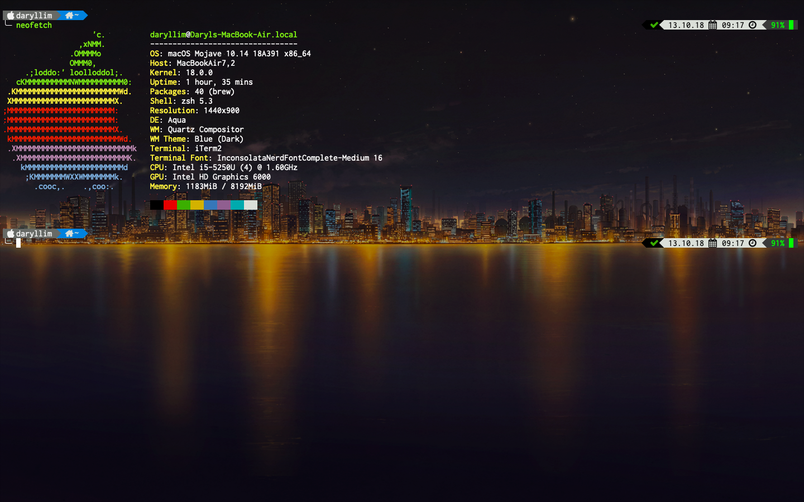
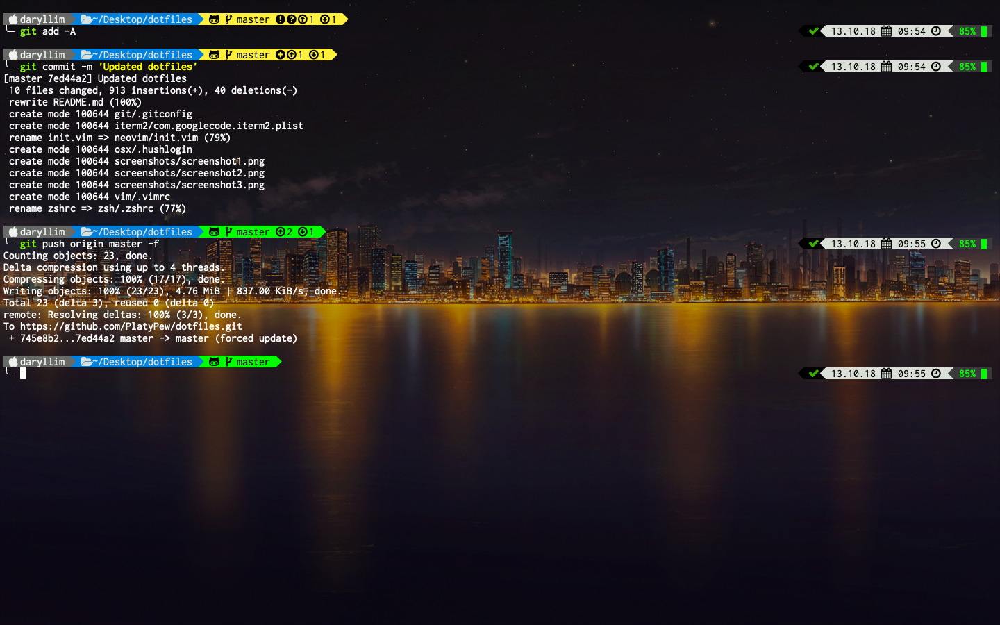
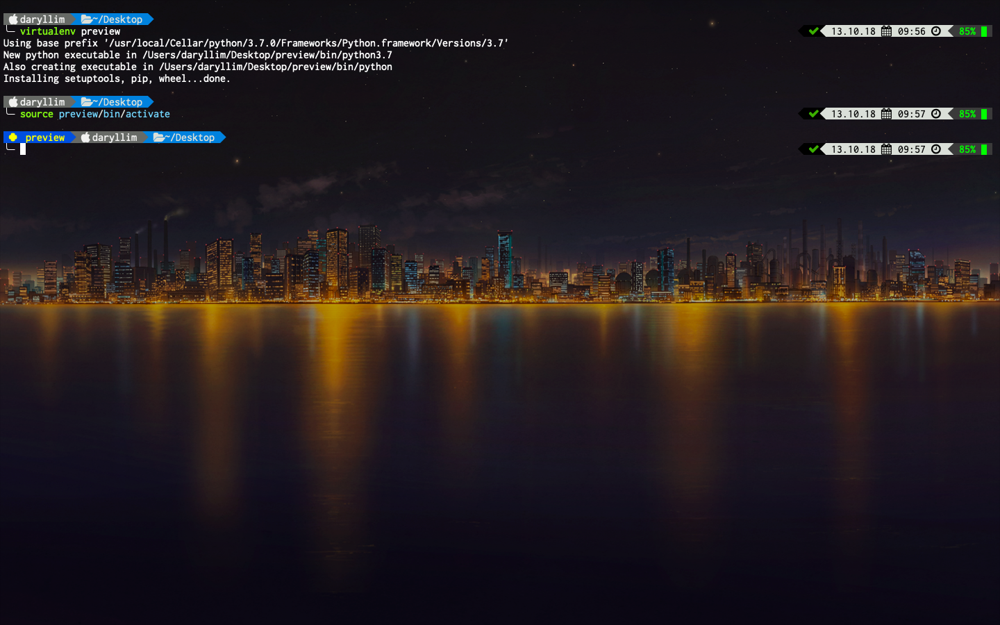
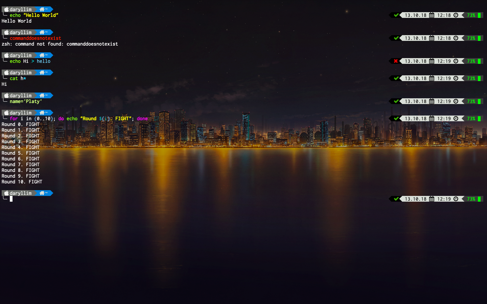
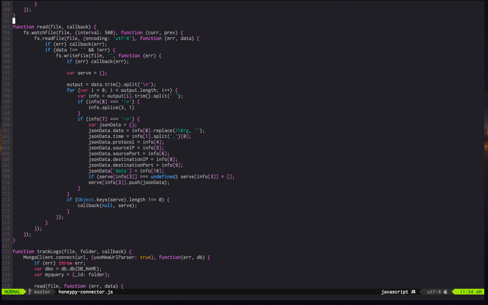
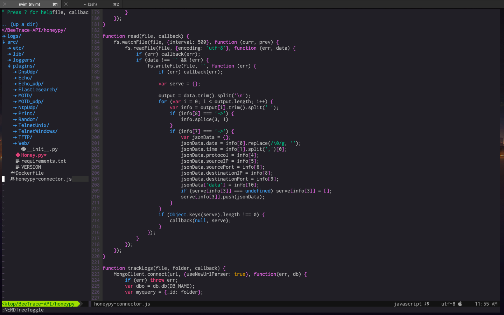
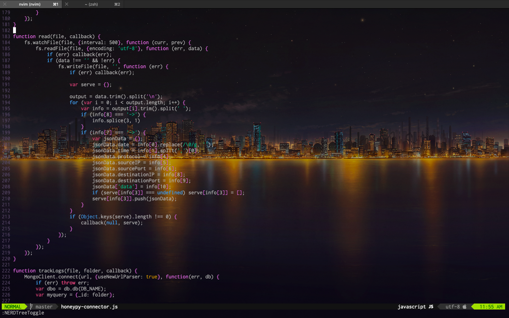
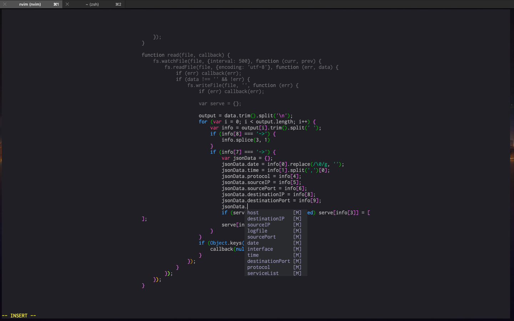

# Dotfiles
Basic terminal configurations for OSX. [Screenshots](#screenshots)

## iTerm2
Install profile: `Preferences` -> `General` -> `Load preferences from a custom folder or URL` -> `Browse`

Image Used: https://www.pixiv.net/member_illust.php?mode=medium&illust_id=39759178

## Neovim
Install [Vim-Plug](https://github.com/junegunn/vim-plug) to use. Copy file `init.vim` into `~/.config/nvim`

```bash
curl -fLo ~/.local/share/nvim/site/autoload/plug.vim --create-dirs https://raw.githubusercontent.com/junegunn/vim-plug/master/plug.vim
```

## OSX
Put `.hushlogin` into home directory to remove last login message

## Vim
Copy file `.vimrc` into `~`

## ZSH
Download the z-shell (can be found on Homebrew)

Download [oh-my-zsh](https://github.com/robbyrussell/oh-my-zsh)

```bash
sh -c "$(curl -fsSL https://raw.githubusercontent.com/robbyrussell/oh-my-zsh/master/tools/install.sh)"
```

Download powerline fonts (can be found on Homebrew)

Install [powerlevel9k](https://github.com/bhilburn/powerlevel9k) into `~/.oh-my-zsh/custom/themes`

Install [zsh-completions](https://github.com/zsh-users/zsh-completions) and [zsh-syntax-highlighting](https://github.com/zsh-users/zsh-syntax-highlighting) into `~/.oh-my-zsh/custom/plugins`

Copy `.zshrc` into `~`

# Screenshots

## ZSH

### Neofetch


### VCS (Git)


### Virtual Environment (virtualenv)


### Syntax Highlighting


## Neovim

### Normal


### NERDTree


### Transparent Mode


### Goyo, Rainbow, Limelight and Deoplete

