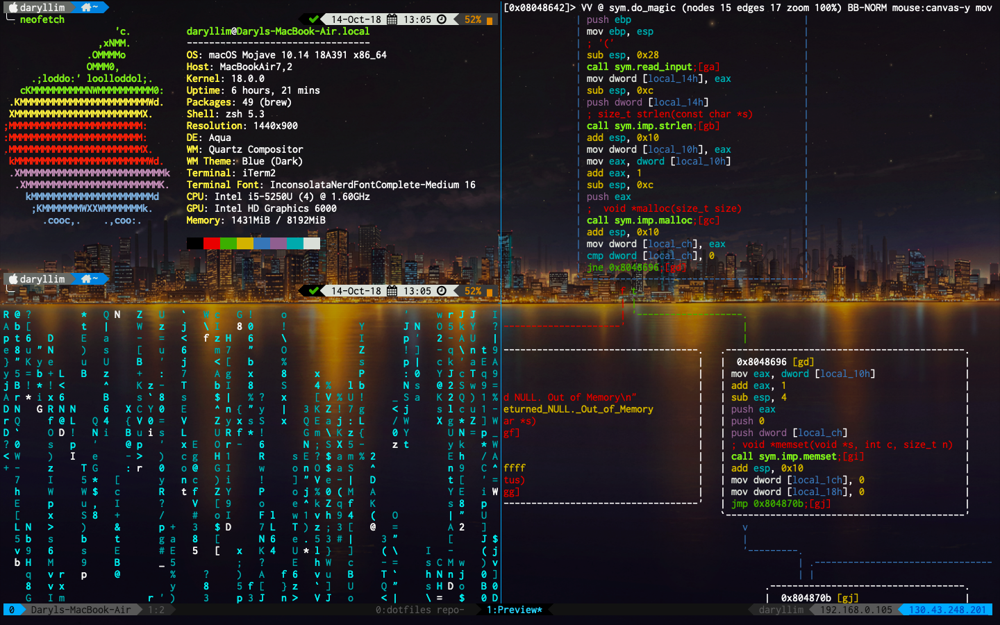

# Dotfiles
Basic terminal configurations for macOS. [Screenshots](#screenshots)

## Contents
- [Quick Installation](#quick-installation)
- [Manual Installaion](#manual-installation)
- [Documentation](#documentation)
- [Screenshots](#screenshots)

# Quick Installation
This script has been only tested macOS Mojave (10.14).

This script will overwrite all existing settings permanently. Do not run unless you know what you're doing.

**I having been updating the install script so it may not work**

Installation
```bash
git clone https://github.com/PlatyPew/dotfiles.git
cd dotfiles/
./install.sh
```

Set your email, name and signing key for git
```bash
git config --global user.name "John Doe"
git config --global user.email "john.doe@email.com"
git config --global user.signingkey "<hash here>"
```

## Possible Issues
### iTerm2
The configurations may not be imported. You can manually change the profile settings.
Do `Command` + `,` to open Preferences.
- `Colors` -> `Color Presets`: _Tango Dark_
- `Text` -> `Font`: _16pt Inconsolata Nerd Font Complete_
- `Window` -> `Background Image`: _~/Documents/Background1.png_
- `Window` -> `Settings for New Windows`: _Columns: 90, Rows: 25_

### Tmux
Local IP does not show up for tmux

Go into `~/.tmux/getLocalIP.sh`, and change the network interface.

# Manual Installation

## iTerm2
Image Used: [灯柱 by コーラ](https://www.pixiv.net/member_illust.php?mode=medium&illust_id=39759178)

## Neovim
Install [Vim-Plug](https://github.com/junegunn/vim-plug) to use. Copy file `init.vim` into `~/.config/nvim`

```bash
curl -fLo ~/.local/share/nvim/site/autoload/plug.vim --create-dirs https://raw.githubusercontent.com/junegunn/vim-plug/master/plug.vim
```

## macOS
Put `.hushlogin` into home directory to remove last login message

## Vim
Copy file `.vimrc` into `~`

## ZSH
Download the z-shell (can be found on Homebrew)

Download [oh-my-zsh](https://github.com/robbyrussell/oh-my-zsh)

```bash
sh -c "$(curl -fsSL https://raw.githubusercontent.com/robbyrussell/oh-my-zsh/master/tools/install.sh)"
```

Download powerline fonts (can be found on Homebrew)

Install [powerlevel9k](https://github.com/bhilburn/powerlevel9k) into `~/.oh-my-zsh/custom/themes`

Install [zsh-completions](https://github.com/zsh-users/zsh-completions) and [zsh-syntax-highlighting](https://github.com/zsh-users/zsh-syntax-highlighting) into `~/.oh-my-zsh/custom/plugins`

Copy `.zshrc` into `~`

## Tmux
Create a folder `~/.tmux` and put the 2 scripts inside.

Copy file `.tmux.conf` into `~`

# Documentation
## ZSH
Plugins:
- git: Shows status on prompt
- zsh-completions
- zsh-syntax-highlighting
- brew

## Neovim
Plugins:
- space-vim-dark
- airline/vim-airline
- airline/vim-airline-themes
- vim-devicons
- limelight.vim
- vim-journal
- rainbow\_parentheses.vim
- gruvbox
- vim-gitgutter
- nerdtree
- deoplete.nvim 
- vim-multiple-cursors
- goyo.vim
- vim-fugitive
- scripts/LargeFile
- fzf.vim

Key bindings:
- `Ctrl-o`: Toggle NerdTree. _Default: Off_
- `Ctrl-h/j/k/l`: Window Switching.
- `Ctrl-t left/right`: Tab Switching.
- `\r`: Toggle Rainbow Parentheses. _Default: Off_
- `\l`: Toggle Limelight. _Default: Off_
- `\G`: Toggle Goyo. _Default: Off_
- `\d`: Toggle Deoplete. _Default: Off_
- `\g`: Toggle GitGutter. _Default: On_
- `\t`: Toggle Transparent Mode. _Default: Off_

## Tmux
Plugins (Self-written):
- getLocalIP.sh
- getPublicIP.sh

IPs update every 15 mins.

Key Bindings:
- Rebinded `Ctrl-b` to `Ctrl-a`
- Rebinded split panes vertically and horizontally: `|`, `-`
- Switch panes: `Option-Left/Right/Up/Down`
- Switch windows: `Shift-Left/Right`

# Screenshots

## ZSH

### Neofetch


### VCS (Git)


### Virtual Environment (virtualenv)


### Syntax Highlighting


## Neovim

### Normal


### NERDTree


### Transparent Mode


### Goyo, Rainbow, Limelight and Deoplete


## Tmux


