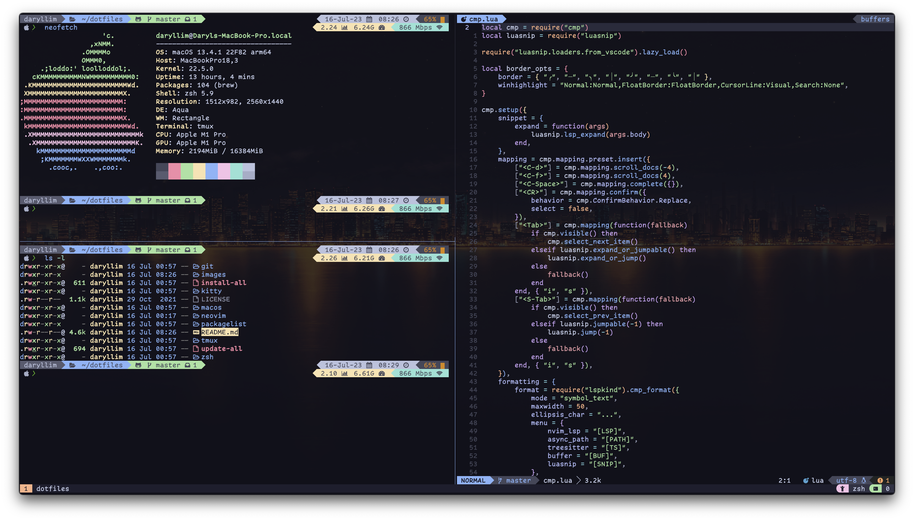

<div align="center">
    
    <br/>
    <br/>
    
    
    
    <br/>
    <h1>Platy's MacOS Dotfiles</h1>
    <p>
    These Dotfiles are used to transform a vanilla system, into one that is loaded with all the tools a developer needs and never look like a normie every again.
    </p>
    
    <br/>
</div>

<div align="center">
    <h1>Installation</h1>
</div>

Please check the `install-all` script and adjust accordingly to what you need and `packagelist/` for software that will be installed.

```sh
git clone --recursive https://github.com/PlatyPew/dotfiles.git ~/dotfiles && \
    cd ~/dotfiles && ./install-all
```

### Software Used

-   autojump
-   bat
-   exa
-   fzf
-   gawk
-   git
-   neovim
-   ripgrep
-   stow
-   tmux
-   zsh

### Miscellaneous

The font used is a paid font called Comic Code.
Please support the official [release](https://www.myfonts.com/products/coding-essentials-package-596221).

<br/>
<div align="center">
    <h1>License</h1>
    <p>This project is released under the <a href="https://github.com/PlatyPew/dotfiles/blob/master/LICENSE">MIT License</a></p>
</div>
